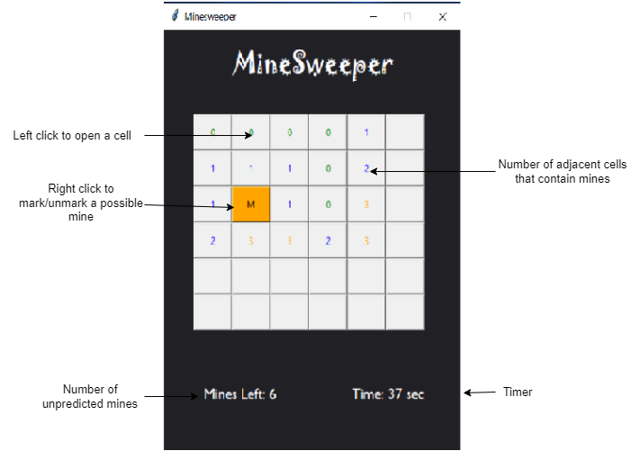

# MinesweeperGUI

Created the Minesweeper game. 
Used python OOP concepts to implement minesweeper logic. 
Used tkinter to add GUI.

## Game Rules

1. <strong>Board Configurations:</strong> 6x6 board size, 7 Mines
2. Minesweeper game board is an array of buttons.
3. If the user left clicks on a cell that contains a mine, the game ends.
4. If the user left clicks on a cell that does not contain a mine, a number appears at that location indicating the number of adjacent cells containing mines.
5. The user can right click a cell to mark a possible mine.
6. The game ends when all the non-mine cells have been clicked OR a mine is clicked.
 

## Built using

- Python
- Tkinter
